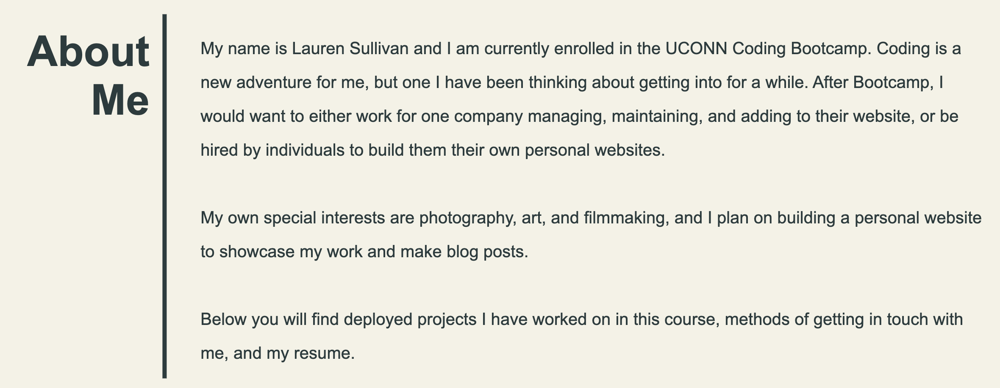
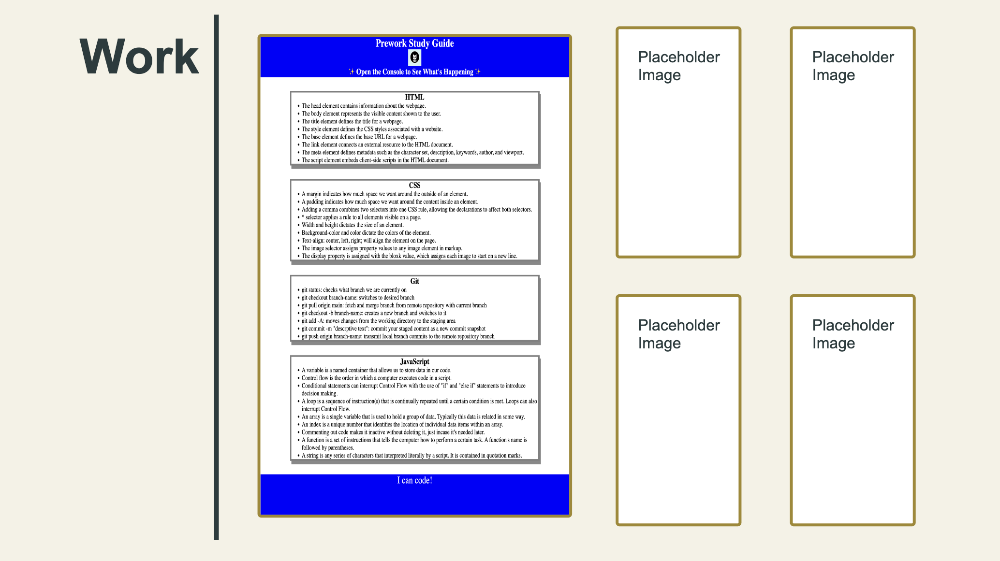
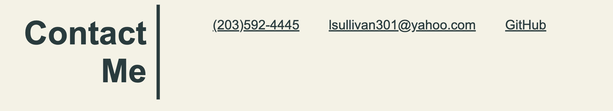
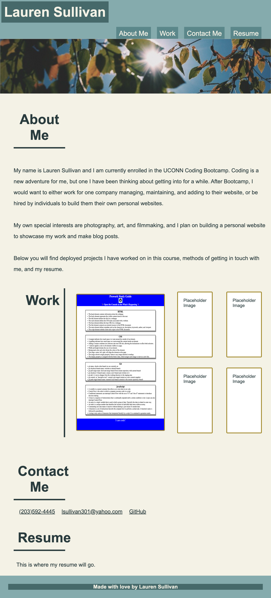
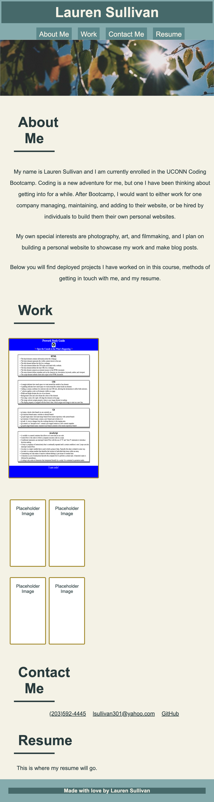
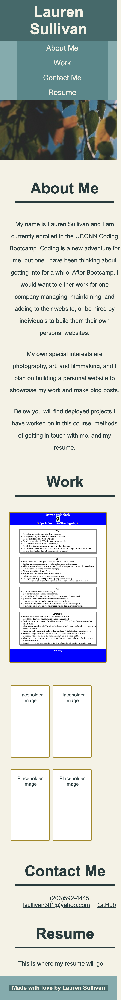

# 02-advanced-css

## Description

For this project, I was tasked with creating a portfolio page to showcase my skills and talents to employers looking to fill a position. Currently, this page is unfinished because the class I'm taking has only just started. I have one project of my own deplyed at this time, so I included it and other placeholder images for now. As class continues, I will exchange the placeholders for real applications with some of my strongest work. The portfolio page I created includes a short about me bio section, a section showcasing images of my work with working links, a contact me section with ways to get in touch with me and look at more of my work, and a resume section that will be added to once I have learned more in class. I have learned that creating a page with a responive layout is important because it makes the page more accessible and easier to navigate. 

## Table of Contents 

- [Installation](#installation)
- [Usage](#usage)
- [Credits](#credits)
- [License](#license)

## Installation

N/A

## Usage

This site contains portfolio information pertaining to me. To view the main set of information, you can either scroll down on the page, or you can click the four header navigation links to take you directly to the information you need as pictured here:

Nav Links:

Information:

The Contact Me section has working links.

The finished site image at stardard viewport:

The finished site at 992px viewport:

The finished site at 768px viewport:

The finished site at 390px viewport:

The finished site link: https://lnsvn.github.io/02-advanced-css/

## Credits

The background image, named background-img.jpg, is a photo that I have taken and edited myself. 

## License

MIT License
